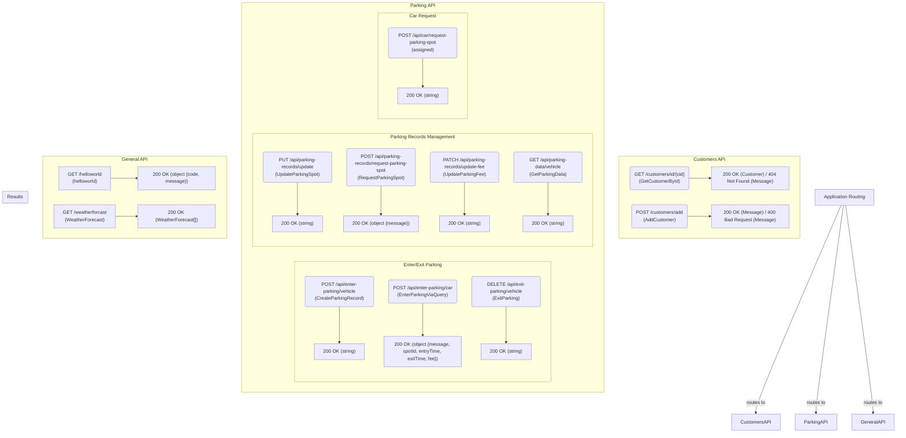

# API Architecture Diagram

This document provides a hierarchical overview of the API endpoints defined in `Program.cs`, illustrating the routing configuration and the different categories of services.

