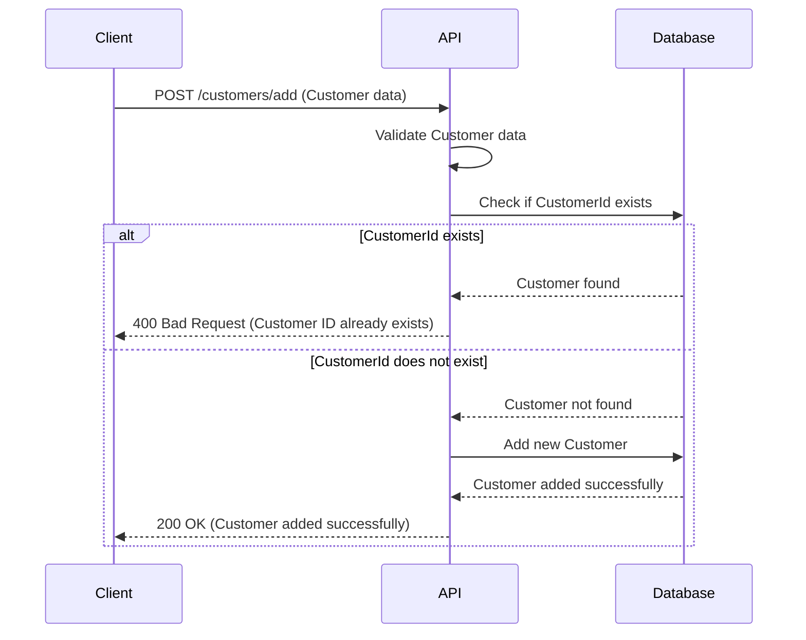

# API Sequence Diagram - Add Customer

This sequence diagram illustrates the process of adding a new customer through the API.

```mermaid
sequenceDiagram
    participant Client
    participant API
    participant Database

    Client->>API: POST /customers/add (Customer data)
    API->>API: Validate Customer data
    API->>Database: Check if CustomerId exists
    alt CustomerId exists
        Database-->>API: Customer found
        API-->>Client: 400 Bad Request (Customer ID already exists)
    else CustomerId does not exist
        Database-->>API: Customer not found
        API->>Database: Add new Customer
        Database-->>API: Customer added successfully
        API-->>Client: 200 OK (Customer added successfully)
    end
```

